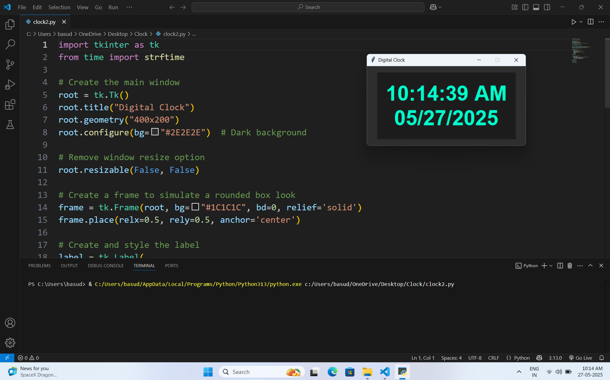

# 🕒 Digital Clock - Tkinter

A stylish digital clock made with Python's `tkinter` GUI library.

## Features

- Displays current time and date
- 12-hour format with AM/PM
- Aqua-blue text on a dark theme
- Auto-updates every second
- Clean and non-resizable window

## Screenshot

 

## Requirements

- Python 3.x
- Tkinter (included with standard Python)

## How to Run

```bash
python digital_clock.py
